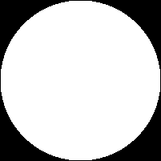
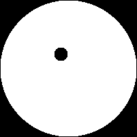

# EulerCharacteristic.jl

`EulerCharacteristic.jl` computes Euler characteristic of objects defined on
two- or three dimensional regular grid (**FIXME**: elaborate on this).

## Examples

According to [this](https://en.wikipedia.org/wiki/Genus_(mathematics)) and
[this](https://www.sciencedirect.com/science/article/abs/pii/S152407032030031X)
articles, the Euler characteristic for a closed surface is defined as `χ = 2 -
2g` where `g` is genus of that surface. For a surface with boundary this
formula becomes `χ = 2 - 2g - b` where `b` is a number of connected components
of the boundary. For a surface embedded in three-dimensional space plus its
interior the Euler characteristic is equal to half of the Euler characteristic
of that surface.

Here are some examples of Euler characteristic:

|  Object  | Description |   g (surface)  |  b (surface)  |   χ   |
|----------|-------------|----------------|---------------|-------|
|  | A disk | 0 | 1 | 1 |
|  | A disk with a hole | 0 | 2 | 0 |
|  | A disk with two holes | 0 | 3 | -1 |
|  | A ball (crossection shown) | 0 | 0 | 2/2 = 1 |
|  | A double torus with interior(crossection shown) | 2 | 0 | -2/2 = -1 |

## Usage

There is `euler_characteristic` function in the package which takes a binary
array and returns Euler characteristic. The value `true` counts as a vertex.

There is also `EulerTracker` type which is a subtype of `AbstractArray` and
allows for fast recalculation of Euler characteristic when an element of
`EulerTracker` is changed.
